# Chameleon

**Бесплатный VPN с открытым кодом, который работает там, где блокируют.**
Клиенты для Android и Windows, свой сервер ставится за 5 минут.

[Скачать](https://github.com/xfgx/Chameleon-CITP-VPN/releases) · [Свой сервер](#свой-сервер-за-5-минут) · [Бенчмарк](#бенчмарк) · [Стать тестером](#нужны-тестеры) · [English](#english)

---

## Что это

- **Одна кнопка.** Режим AUTO сам выбирает транспорт (KS, CITP, ChaosSync), который проходит в вашей сети.
- **Не похож на VPN.** Нет узнаваемого рукопожатия, длины и тайминги пакетов меняются, на чужие запросы нода молчит.
- **Свой порт у каждого.** У каждого пользователя свой UDP-порт и свой ключ на RU-ноде и на плече до зарубежного выхода.
- **Бесплатно и открыто.** Лицензия MIT, без аккаунтов, рекламы и телеметрии.

## Как устроено

```
 Клиент ──KS/UDP──► RU-нода ──ks-relay──► Выход за рубежом ──► Интернет
 (Android,          порт = база+слот      порт = база+слот,
  Windows)          (ks-hub)              свой ключ и адрес
```

1. Клиент подключается к RU-ноде на свой персональный порт `USER_PORTBASE + слот` (общий порт хаба тоже работает).
2. RU-нода передаёт трафик пользователя на выход по своему сеансу `ks-relay`: отдельный порт `RELAY_PORTBASE + слот` и отдельный ключ `HMAC(master, слот)`.
3. Выход сам устанавливает сеансы к RU-ноде, поэтому ему не нужны входящие порты.

## Быстрый старт (пользователю)

| Платформа | Что сделать |
|---|---|
| Android | Установите APK из [Releases](https://github.com/xfgx/Chameleon-CITP-VPN/releases), вставьте ключ, нажмите «Подключить» |
| Windows | Запустите установщик `Chameleon-Setup.exe`, вставьте ключ, нажмите «Подключить» |

Ключ выдаёт владелец сервера. Если у вас своего сервера нет, загляните в раздел «[Нужны тестеры](#нужны-тестеры)».

## Свой сервер за 5 минут

Нужны две Linux-машины: RU-нода (вход) и зарубежная нода (выход). Подойдут VPS с 1 vCPU и 1 ГБ RAM.

```bash
git clone https://github.com/xfgx/Chameleon-CITP-VPN chameleon && cd chameleon
make setup && ./bin/chameleon-setup        # Windows: bin\chameleon-setup.exe
```

`chameleon-setup` задаст 8 вопросов:

| Вопрос | Варианты |
|---|---|
| Адрес RU-ноды | IP или домен (на самой ноде определяется автоматически) |
| Адрес выхода | IP или домен |
| IP для админки | через запятую |
| Порт хаба | `auto` (свободный случайный) / `default` (51830) / число |
| Максимум пользователей | 1–4000 |
| Персональные порты пользователей | `auto` (56000+слот) / `off` / база |
| Порты плеча RU↔выход | `auto` (52000+слот) / база |
| Домен и бот активации | можно пропустить |

Мастер заменит в репозитории все заглушки (`192.0.2.10`, `198.51.100.10`, `vpn.example.com`, `<REDACTED>` …) на ваши значения и создаст:

- `.env.chameleon` — все параметры;
- `secrets/relay-master.key` — ключ плеча (0600, в git не попадает);
- `.chameleon-setup/RUN.md` — готовые команды запуска для обеих нод.

Оригиналы файлов сохраняются в `.chameleon-setup/backup/`. Откатить: `chameleon-setup -undo`. Посмотреть изменения без записи: `-dry-run`. Без вопросов (CI): `-answers answers.json -yes`.

## Бенчмарк

```bash
./bench/bench.sh            # меню: 1 скорость · 2 пользователи/ресурсы · 3 скорость/число пользователей
./bench/bench.sh status     # какие чекпоинты пройдены
./bench/bench.sh charts     # SVG-графики по результатам → bench/results/<прогон>/charts/
```

Каждый шаг сохраняет чекпоинт. После обрыва бенчмарк продолжит с того же места. Подробно: [bench/README.md](bench/README.md).

### Результаты (RU-нода 2 vCPU / 2 ГБ, хаб ограничен 1 vCPU и 700 МБ)

10 % пользователей активны (20 пакетов/с по 1000 Б), остальные шлют keepalive. Базовый RTT до ноды 125 мс. В ячейке: сколько пользователей на связи и p95 RTT.

<p>
 
 
</p>

<details><summary>Таблица с цифрами</summary>

| Пользователей | ks-hub 2 (было) | ks-hub 3, общий порт | ks-hub 3, свой порт |
|---|---|---|---|
| 100 | 100 · 165 мс | 100 · 218 мс | **100 · 178 мс** |
| 300 | 300 · 1,3 с | 300 · 2,6 с¹ | **300 · 0,7 с** |
| 500 | 500 · 3,1 с | 500 · 1,8 с | 500 · 1,9 с |
| 700 | 699 · 5,8 с | 700 · 3,4 с | 700 · 3,5 с |
| 1000 | **отказ** (0 на связи) | 1000 · 10,7 с, потери 16 % | 898 · 9,6 с, потери 52 % |
| Пик RAM при 1000 | 424 МБ | 125 МБ | 145 МБ |

</details>

¹ Во время этой ступени на машине-генераторе шла сборка, поэтому замер завышен.

Итог: одно ядро комфортно держит **~300 пользователей** (p95 < 0,7 с со своими портами). До 700 пользователей все остаются на связи, но задержка растёт. На 1000 хаб 3 больше не падает целиком, как хаб 2. Узкое место — CPU хаба (очередь приёма переполняется), памяти хватает с запасом. Больше пользователей — больше ядер: `bench.sh capacity` с `PROFILES="1:512 2:1024 4:2048"`.


## Сборка

Нужен Go ≥ 1.26.

```bash
make setup          # мастер настройки → bin/chameleon-setup и bin/chameleon-setup.exe
make node           # ks-hub и ks-relay для нод → bin/
make bench-tools    # + генератор нагрузки ks-stress
make build test     # сборка и тесты всех пакетов
```

Подробная инструкция по сборке и установке всех компонентов (CITP-нода, клиенты, ключи): [docs/README-FULL.md](docs/README-FULL.md).

Android: `gomobile bind -target=android/arm64 -o android/app/libs/mobilecore.aar ./mobilecore`, затем `cd android && ./gradlew assembleRelease`.

## Что где лежит

| Путь | Что это |
|---|---|
| `android/`, `desktop/`, `cmd/chamd` | Клиенты Android и Windows |
| `cmd/ks-hub` | Хаб клиентов на RU-ноде (общий и персональные порты) |
| `cmd/ks-relay` | Плечо RU-нода ↔ выход, по сеансу на пользователя |
| `cmd/cham-server` | Нода CITP |
| `cmd/chameleon-setup` | Мастер настройки |
| `cmd/ks-stress`, `bench/` | Нагрузочный генератор и бенчмарк |
| `internal/`, `mobilecore/` | Ядро протоколов |
| `docs/`, `protocol/` | Документация и спецификации |

## Безопасность

Модель угроз: [THREAT_MODEL.md](THREAT_MODEL.md). Как сообщить об уязвимости: [SECURITY.md](SECURITY.md). Ключи создаются только локально и не попадают в репозиторий.

## Нужны тестеры

Нужны люди из разных городов и у разных провайдеров: мобильный интернет, домашний, офисный Wi-Fi. Оставьте [issue с шаблоном «Тестер»](https://github.com/xfgx/Chameleon-CITP-VPN/issues/new?labels=tester&title=%D0%A2%D0%B5%D1%81%D1%82%D0%B5%D1%80) и укажите город, провайдера и устройство. Мы пришлём ключ. В ответ просим рассказать, что сработало, а что нет.

Свои предложения присылайте через Pull Request, см. [CONTRIBUTING.md](CONTRIBUTING.md).

## Лицензия

MIT: [LICENSE](LICENSE). Сторонние компоненты (Wintun, .NET, Go-модули) распространяются под своими лицензиями: [packaging/THIRD-PARTY-NOTICES.txt](packaging/THIRD-PARTY-NOTICES.txt).

---

## English

**Chameleon is a free, open-source VPN built to work where VPNs get blocked.** It has Android and Windows clients, and you can set up your own server in 5 minutes.

- **One button:** AUTO mode picks the transport (KS, CITP, ChaosSync) that gets through on the current network.
- **Per-user ports and keys:** each user has their own port and key, both on the entry node and on the relay to the exit node.
- **Own server:** `make setup && ./bin/chameleon-setup` asks 8 questions (node addresses, ports `auto`/`default`/custom, user count, domain). It then replaces every placeholder in the repo and writes ready-to-run commands to `.chameleon-setup/RUN.md`.
- **Benchmark:** `./bench/bench.sh` runs a speed comparison, max users per server size, and speed vs. user count. It saves a checkpoint after every step.
- **Testers wanted:** open an issue labelled `tester` with your city, ISP and device, and we will send you a key.

License: MIT.
